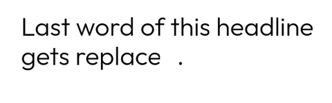
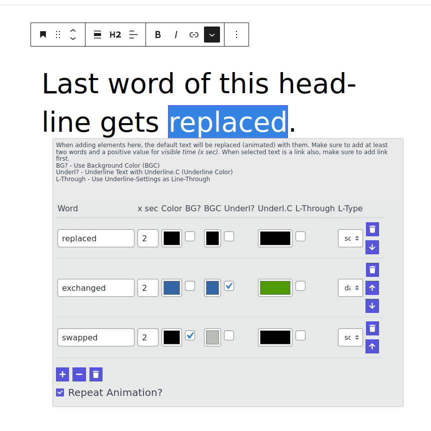
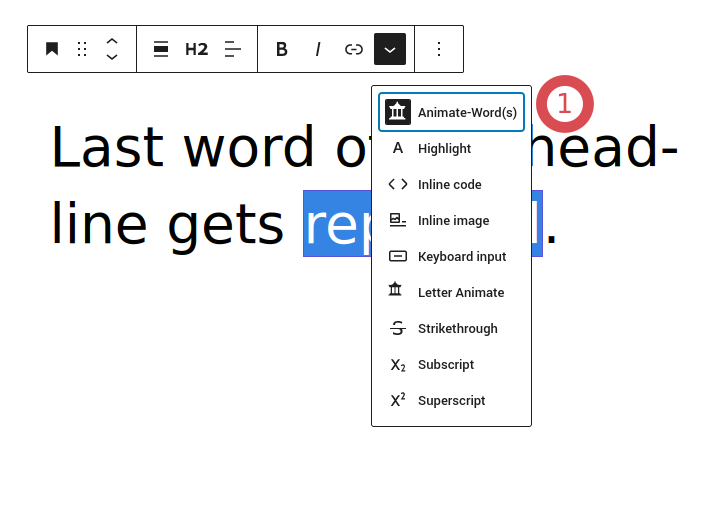

# Yours59 Animate Span Exchanges

This Wordpress / Gutenberg plugin allows you to animate parts of text by exchanging words.

## Description

This Wordpress / Gutenberg plugin allows you to animate parts of text by exchanging words.




For each exchanging Word / Span you can set:
- Color
- The time its visible 
- Background-Color
- Underline-Color
- Set underline as `line-through`
- Type of underline (solid, wavy, dashed)   
- If the whole animation should get repeated

### Screenshot of interface in gutenberg editor



### Screenrecording of output in frontend


## Background
I was looking for a solution to animate text-spans by replacing them with one or multiple other word(s).
Therefore I implemented a RichTextToolbarButton with an URLPopover (both  standard Gutenberg components).
Inside the URLPopover a json-editor-form (https://github.com/json-editor/json-editor) is shown.

Also I wanted to find a more "lazy" way to have things like "repeatable objects" in gutenberg editor. 
To do this with the standard react/gutenberg way you probably have to write much more code than just the approx. 300 lines used at moment. 

The main part consists of this simple json-schema which is compiled into a html-form by https://github.com/json-editor/json-editor.

```
	const schema = {
	    title: 'Word replacement Animations', // hidden via CSS
	    format: 'table', //categories, grid-strict, grid , table
	    disable_collapse: true,
	    properties: {
	        texts: {
	            type: 'array',
	            format: 'table',
	            disable_collapse: true,
	            // title: 'Add / Remove Word Replacements',
	            items: {
	                type: 'object',
	                format: 'table', // grid , table
	                title: 'Word',
	                disable_collapse: true,
	                properties: {
	                    name: {
	                        type: 'string',
	                        title: 'Word',
	                    },
	                    stay_for: {
	                        title: 'x sec',
	                        type: 'number',
	                        default: 2,
	                        options: {
	                            inputAttributes: {
	                                placeholder:  "2s",
	                            }
	                        }
	                    },
	                    color: {
	                        title: 'Color',
	                        type: 'string',
	                        format: 'color',
	                        default: '#FFFFFF',
	                        options: {
	                            infoText: 'Text Color', // not working in table (?)
	                            colorpicker: { 
	                                'alpha': true // not working 
	                            }
	                        },
	                    },
	                    bg: {
	                        title: 'BG?',
	                        type: 'boolean',
	                        format: 'checkbox',
	                    },
	                    bg_color: {
	                        title: 'BGC',
	                        type: 'string',
	                        format: 'color',
	                        default: '#FFFFFF',
	                    },
	                    line: {
	                        title: 'Underl?',
	                        type: 'boolean',
	                        format: 'checkbox',
	                    },
	                    line_color: {
	                        title: 'Underl.C',
	                        type: 'string',
	                        format: 'color',
	                        default: '#FFFFFF',
	                    },
	                    line_through: {
	                        title: 'L-Through',
	                        type: 'boolean',
	                        format: 'checkbox',
	                    },
	                    line_type: {
	                        title: 'L-Type',
							enum: [ "solid", "wavy", "dashed"], // shows empty option at begin
							type: "string",
	                    },
	                },
	            },
	        },
	        repeat: {
	            title: 'Repeat Animation?',
	            type: 'boolean',
	            format: 'checkbox',
	            default: true,
	        },
	    },
	};
```

Even if there is a react based implementation of jsonschema-form (https://github.com/rjsf-team/react-jsonschema-form), I choose to go with *json-editor* (https://github.com/json-editor/json-editor).
I made some good experiences with it and also know that these *json-schema to html-form* softwares can be challenging. 

## Known Issues

The interface is not very "gutenberg/wordpress-like". But its working and produces the desired output.
And the code is kind of lean :-)

There are still some browser-issues with text-decoration:underline (see https://www.tempertemper.net/blog/styling-underlines-with-css)

Do not overuse this animation effect. The frontend-animations are simply done with `setTimeout` (and when repeated) `setInterval`. As we know these are not the most performant ways to animate things. But I think its ok for a couple of elements on the page.

When you want the selected text-element to be a link, you have to set the link first, then the animation.


## WP Plugin Info

*Plugin is not yet in official wordpress.org/plugins repo*

- **Author**: larslo
- **Tags**: gutenberg, wordpress, RichTextToolbarButtons, Animation, text-change animation
- **Requires at least**: 5.9
- **Tested up to**: 6.0.1
- **License**: GPLv2 or later
- **License URI**: http://www.gnu.org/licenses/gpl-3.0.html
- **Requires PHP**: 7.4
- **Stable tag**: 0.9.0


## Installation

1. Clone / Download and move files to `/wp-content/plugins/yours59_animate_span_exchange` directory
2. Activate the plugin via the 'Plugins' screen in WordPress
3. You should see "Animate Word(s)" in RichTextToolbarButtons (see screenshot below)




## TODO

- better styling of json-schema form inside Gutenberg Popup